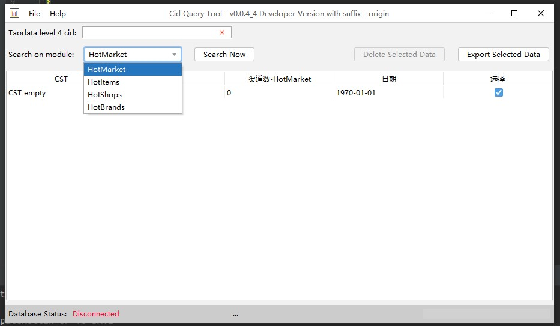
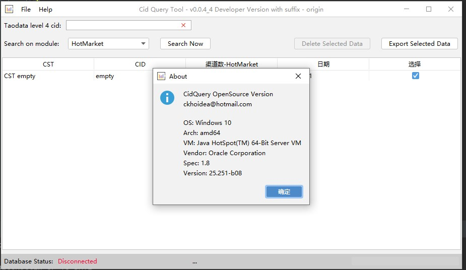

# CidQuery OpenSource Version

A simple desktop software written in Java and Kotlin for exploring and exporting data from database. Based on Java
Swing.

## Screenshots:

## 3th Party Dependency:

- Kotlin Coroutines
- FlatLaf
- Apache POI
- HikariCP
- JDBI3
- MySQL Connector Java

